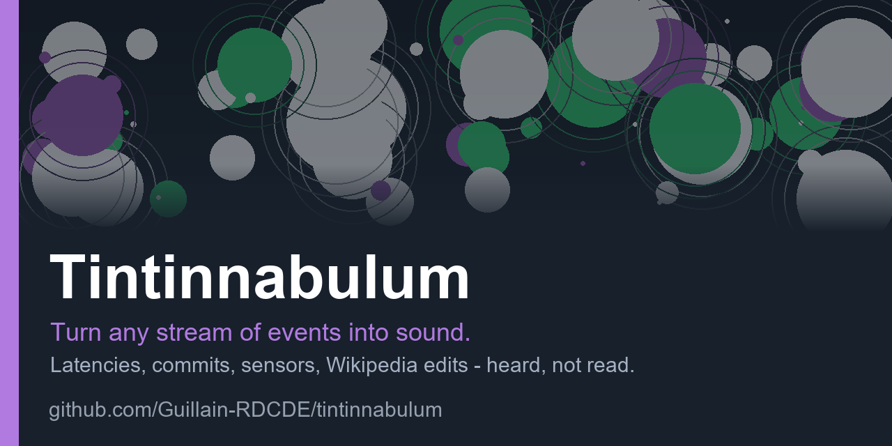

<p align="center">
  
</p>

# Tintinnabulum

**Turn any stream of events into sound.** Numbers you would normally read in a
dashboard become bells and plucked strings — large values low, small values high
— so you can hear what your data is doing while you look at something else.

**[Open the sandbox](https://guillain-rdcde.github.io/tintinnabulum/)** — nothing
to install, runs in your browser. · **[How it works](docs/HOW-IT-WORKS.md)** —
the whole pipeline, explained from first principles. ·
**[Reference](#reference)**

> *tintinnabulum, -i, n.* — Latin for a small bell. The plural, *tintinnabuli*,
> is the name Arvo Pärt gave to his bell-like compositional style.

---

## Getting started

**[Open the sandbox.](https://guillain-rdcde.github.io/tintinnabulum/)** Press
**Start listening to Wikipedia**. That is the only step; the button also asks
the browser for permission to make sound.

You are now listening to Wikipedia. Every circle is somebody editing an article,
somewhere in the world, at that moment.

- **A bell** means text was added. **A plucked string** means text was removed.
- **A low note** is a large edit; **a high note** is a small one.
- **Green** marks an anonymous editor, **purple** a bot, **white** a logged-in
  contributor. *(Those are the default colours; there are nine palettes.)*
- Clicking a circle opens the article that produced the sound.

That is the whole idea. It is designed to be left running in a background tab,
and it works on a phone.

The sandbox opens in a simple view: one button, the colour palettes, and
nothing else. **Advanced settings** reveals the full panel — sources, languages,
instruments, scales, filters, recording — and the choice is remembered. If you
would rather not listen to Wikipedia, choose **Synthetic traffic** there for a
stream of generated events. To hear your own data, see
[Sending your own data](#sending-your-own-data) — it is one `curl` command.

For an explanation of what actually happens between the live feed and the note
in your speakers, see **[How it works](docs/HOW-IT-WORKS.md)**, which covers it
in plain language first and in full detail afterwards.

### Worth trying

| Setting | Effect |
|---|---|
| **Instruments → Synthesis** | The same events played by a synthesiser rather than recorded bells. No audio files are involved. |
| **Mapping → Scale → pentatonic** | Notes snap to a five-note scale, and the result sounds composed rather than arbitrary. |
| **Languages → `en,fr,de,ja`** | Four Wikipedias at once: busier, denser, more musical. |
| **Palette** | Nine looks, from *Nocturne* to *Bronze* to *Daylight*. Circles already on screen recolour immediately, and the choice is remembered. |
| **Instruments → Record** | Captures what you are hearing to an audio file. |
| **Untick "Big event = low note"** | Inverts the mapping. Large edits become shrill — worse, but instructive. |

---

## Reference

A dependency-free sonification engine. Anything reducible to
**(magnitude, polarity, identity)** can be heard and seen: request latencies,
commits, build results, queue depths, sensor readings, Wikipedia edits.

No build step, no bundler, no `npm install`. ES modules and `node:http`.

### The event contract

`magnitude` is the only required field.

| Field | Type | Meaning |
|---|---|---|
| `magnitude` | number | Size of the event. Drives pitch and radius. A negative value implies `polarity: -1`. |
| `polarity` | `1` / `-1` / `0` | Instrument choice: bell, pluck, neutral. |
| `id` | string | Stable identity. Seeds the on-screen position, so the same id always lands in the same place — an article edited twice pulses in one spot. |
| `category` | string | Colour and instrument override (`user`, `anon`, `bot`, `alert`, or your own). |
| `accent` | boolean | Rare, notable event: plays the swell, shows a banner, bypasses voice stealing. |
| `label` / `url` | string | Shown on hover; clicking the circle opens the url. |
| `ts` | number | Epoch ms, defaults to now. |
| `data` | any | Your original payload, passed through untouched. |

### Library use

```js
import { Sonifier, CanvasSink, wikipedia } from './src/index.js';

const son = new Sonifier({
  kit: 'synth',                       // or 'hatnote' for the sampled bells
  mapping: { mode: 'adaptive', scale: 'pentatonic', range: 27 },
  voices: { maxVoices: 16, maxPerSecond: 25 },
});

son.use(new CanvasSink('#canvas', { palette: 'bronze' }));
await son.unlock();                   // must be called from a click handler
son.connect(wikipedia({ langs: ['en', 'fr'] }));

son.emit({ magnitude: 512, id: 'anything', category: 'alert' });
```

### Pitch that calibrates itself

Most sonification code carries a constant tuned to one dataset, which makes it
useless for any other. The default `adaptive` mapping instead ranks each
magnitude against a rolling window of the last 500, so an unfamiliar source
finds its own range within about sixteen events.

The test suite pins down the difference. Given latencies clustered between 40
and 60 ms, a fixed logarithmic curve tuned for Wikipedia's byte counts collapses
into **one semitone**, while the adaptive mapping still spans the full **27**.
Use `log` or `linear` with an explicit `domain` when the range is known in
advance.

### Voice allocation

Under load, a note may steal the weakest sounding voice rather than being
dropped in arrival order, so a burst of small events never masks the one large
event inside it. `maxPerSecond` adds a token-bucket ceiling on top.

### Sources

| Factory | Use |
|---|---|
| `wikipedia({langs, backend})` | `'eventstreams'` (Wikimedia's own HTTPS SSE) or `'wikimon'` (adds `geo_ip`, `hashtags`, `mentions`) |
| `sseSource({url, map})` | Any Server-Sent Events feed |
| `websocketSource({url, map})` | Any WebSocket, with exponential-backoff reconnect |
| `pollSource({url, interval, map})` | Any JSON endpoint, with de-duplication by id |
| `ingestSource({url})` | The bundled ingest server |
| `manualSource()` | Push events in by hand |
| `randomSource({rate})` | Synthetic traffic, for tuning without a network |

A source is any object with `{ name, start(emit), stop() }`, so writing your own
takes a dozen lines.

### Sending your own data

Run the ingest server, which also serves the page:

```bash
node server/ingest.mjs           # http://localhost:8080/demo/
```

```
POST /emit          {"magnitude": 1200, "id": "build-42"}     — or an array
GET  /emit?magnitude=42&id=quick-test                          — convenient from curl
GET  /events[?replay=20]                                       — SSE fan-out
GET  /stats
```

Query parameters name the target fields. A value beginning with `$.` is a path
into the posted body; anything else is a literal. That single rule is what
allows arbitrary JSON to be piped in without writing an adapter:

```bash
# request latency, straight from your own logs
curl -X POST "localhost:8080/emit?magnitude=\$.duration_ms&id=\$.route&category=\$.level" \
     -H 'Content-Type: application/json' \
     -d '{"route":"/api/users","duration_ms":312,"level":"warn"}'

# a repository's history: one note per commit, pitched by lines changed
git log --format='%H' -n 200 | while read sha; do
  n=$(git show --numstat --format= "$sha" | awk '{s+=$1+$2} END {print s+0}')
  curl -s -o /dev/null "localhost:8080/emit?magnitude=$n&id=$sha"
done
```

Fan-out uses Server-Sent Events rather than WebSocket: the browser only ever
consumes this stream, `EventSource` reconnects on its own, and SSE requires
nothing beyond `node:http`.

### Instruments

Implement `load(ctx)` and `play(ctx, dest, {semitone, velocity})` and you have a
new instrument.

- `SampleInstrument` plays recorded banks, resampled through `playbackRate`, so
  pitch is continuous rather than limited to the number of recorded notes.
- `SynthInstrument` needs no audio files: FM and subtractive presets (`bell`,
  `glass`, `clang`, `pluck`, `woody`, `blip`, `pad`).

`hatnoteKit()` and `synthKit()` return ready-made `{add, sub, accent}` sets and
are interchangeable at runtime. Sample banks resolve relative to the library
itself, so the project runs from any mount point.

### Palettes

Nine, selectable at runtime and stored as plain data in
[`src/visual/palettes.js`](src/visual/palettes.js):

| | | |
|---|---|---|
| **Nocturne** — slate blue, the default | **Bronze** — brass and copper | **Aurora** — mint and violet |
| **Ember** — banked fire | **Ultraviolet** — magenta and cyan | **Blueprint** — technical, calmest |
| **Sakura** — blossom on plum | **Daylight** — ink on paper, for projectors | **Monochrome** — lightness only |

```js
new CanvasSink('#canvas', { palette: 'bronze' });
sink.setPalette('aurora');                    // circles already drawn recolour
sink.setPalette({ anon: '#00ffcc' });         // or override individual roles
```

Adding one means adding an entry to that file. The test suite holds them to
measured standards rather than taste: label text must clear WCAG AA (4.5:1)
against its background, circles must remain visible at their 50 % fill opacity,
and the categories must be perceptually distinct — **CIELAB ΔE ≥ 22**, not
luminance contrast, because two colours can differ obviously to the eye while
sharing a luminance band. *Monochrome* is the deliberate exception, held to a
lightness floor instead, since its purpose is to remain readable without colour
vision.

### Tests

```bash
npm test              # core logic and the ingest server
npm run test:browser  # headless Chromium, if playwright-core is installed
```

The browser suite verifies audio by rendering instruments through an
`OfflineAudioContext` and measuring peak amplitude, so a silent instrument
fails rather than passing quietly.

### Layout

```
src/core/     event contract, adaptive mapper, voice allocator, Sonifier facade
src/audio/    AudioContext and unlock, instruments, audio sink, recorder
src/visual/   Canvas renderer and palettes
src/sources/  Wikipedia, SSE, WebSocket, poll, manual, random
server/       zero-dependency ingest and static server
sounds/       sampled celesta, clavichord and string swells
demo/         the sandbox page
test/         core, server and browser checks
```

---

<sub>The idea — a bell for growth, a plucked string for shrinkage, pitch inversely proportional to the size of the change — comes from <a href="https://github.com/hatnote/listen-to-wikipedia">Listen to Wikipedia</a> by Stephen LaPorte and Mahmoud Hashemi, and through it from <a href="https://www.bitlisten.com/">BitListen</a> by Maximillian Laumeister. The sample banks in <code>sounds/</code> are redistributed from that project under its BSD 3-Clause licence. Tintinnabulum is an independent implementation, not a fork, and is not endorsed by any of the above — see <a href="NOTICE">NOTICE</a>, and use <code>kit: 'synth'</code> to ship no third-party audio at all. BSD 3-Clause, see <a href="LICENSE">LICENSE</a>.</sub>
